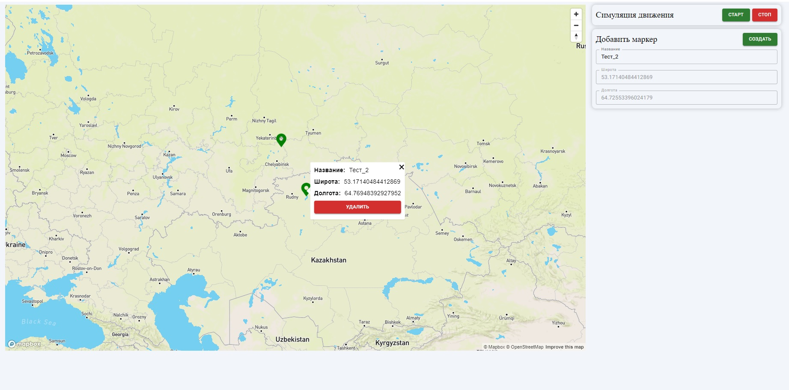

# Map

Цель: изучение NodeJS, webSocket, mongoDB, mapBox.

Описание: приложение разделено на карту и небольшую панель управления.

При запуске приложения, сервер связывается с удалённой БД, получает текущие сохранённые метки и отдаёт через сокеты клиенту.

Панель управления имеет:

- симуляция движения (старт, стоп): при старте, маркеры плавно перемещаются по карте на рандомные значения, с синхронизацией через БД, стоп - остановка движения.

- добавления маркера: клик на карту - получили координаты, создали маркер, так же маркер можно удалять при клике на него.

